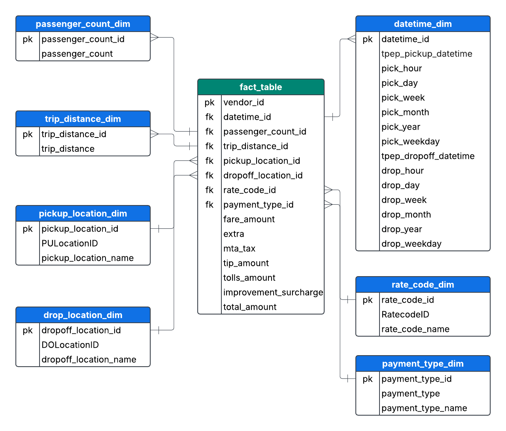

# 🚕 NYC Taxi Data Pipeline

## 📌 Project Overview

A modern data pipeline to analyze NYC Yellow Taxi trip data using Google Cloud services and Mage AI. This project showcases the end-to-end development of a data pipeline that processes over **1.5 million NYC Yellow Taxi trip records** to generate actionable insights through interactive dashboards.

---

## 🏗️ Architecture

### 🔧 Technologies Used
- **Google Cloud Storage (GCS)** – For raw data storage
- **Mage AI** – For orchestration and transformation logic
- **BigQuery** – As the data warehouse
- **Looker Studio** – For dashboarding and KPI visualization
- **Python, SQL** – For data processing and querying

---

## 🗂️ Data Model

The project follows a **star schema** design for analytical efficiency. It includes a **fact table** for trip data and several **dimension tables** for date, payment type, rate code, and location details.

---

## 🔍 Features & Workflow

- ✅ **Data Lake Setup**: Loaded raw NYC Taxi trip data into **GCS**. Dataset used can be found [here](https://www.nyc.gov/site/tlc/about/tlc-trip-record-data.page)
- ✅ **Data Modeling**: Created **fact** and **dimension** tables to support analytical queries.
- ✅ **ETL Pipeline**: Developed using **Mage AI** to extract, clean, transform, and load data.
- ✅ **Data Warehouse**: Stored curated data in **BigQuery** for fast and scalable analysis.
- ✅ **Dashboards**: Designed **Looker Studio** dashboards to visualize **10+ KPIs** including trip trends, payment types, and trip distance.

---

## 📊 Dashboard Preview

---

## 📬 Contact

Feel free to reach out via [GitHub](https://github.com/IshaM10) or [LinkedIn](https://linkedin.com/in/isha-mhatre) for collaboration or questions!
